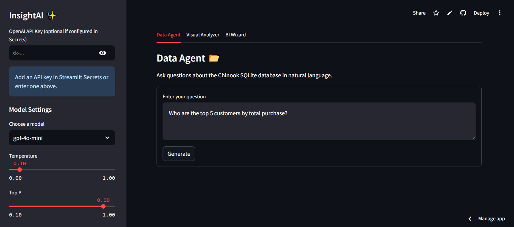
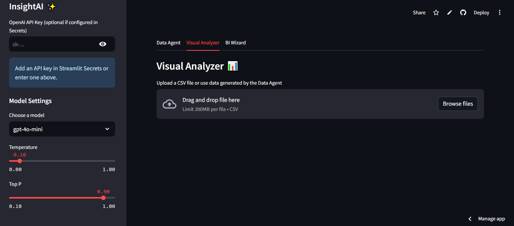
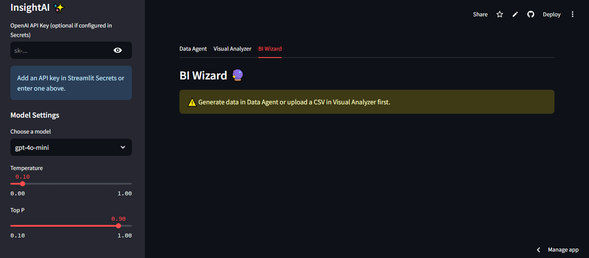

# InsightAI ✨

### Generative AI Data Intelligence Platform

[](https://insightai-generative-ai-data-intelligence-platform.streamlit.app/)
[](https://www.python.org/)
[](https://platform.openai.com/)
[](https://github.com/Aditya-Kusale/InsightAI)

> An AI-powered data intelligence platform that enables users to interact with databases using natural language, generate SQL queries, explore data visually, and derive business insights through interactive AI-assisted workflows.

## 🚀 Live Demo

**Try InsightAI here:**  
👉 **https://insightai-generative-ai-data-intelligence-platform.streamlit.app/**

---

## 📌 Overview

InsightAI bridges the gap between business questions and data analysis. Instead of requiring users to manually write SQL queries or build dashboards, the platform provides an intuitive natural-language interface for exploring and understanding data.

The application combines Large Language Models (LLMs), LangChain, SQL databases, interactive visualizations, and AI-powered analytics into a unified Streamlit application.

---

## ✨ Key Features

### 🤖 Data Agent
Ask questions about the connected SQLite database in natural language.

- Natural language to SQL generation
- AI-assisted database querying
- Automated query execution
- Structured tabular results
- Configurable LLM settings

### 📊 Visual Analyzer
Upload and explore CSV datasets interactively.

- CSV file upload
- Interactive data exploration
- Automated visual analysis
- Dynamic charts and insights
- Low-code analytics experience powered by PygWalker

### 🔮 BI Wizard
Generate business intelligence insights from available data.

- AI-assisted business analysis
- Data-driven insight generation
- Interactive analytics workflow
- Integrated visualization capabilities

### ⚙️ Configurable AI Settings

- Model selection
- Temperature control
- Top-P configuration
- Secure API key handling through Streamlit Secrets
- Optional sidebar API key input

---

## 📸 Application Screenshots

### Data Agent
Ask questions about the Chinook SQLite database using natural language.



### Visual Analyzer
Upload CSV files and explore datasets interactively.



### BI Wizard
Generate AI-assisted business intelligence insights.



---

## 🏗️ Architecture

```text
                    ┌─────────────────────┐
                    │       User          │
                    └──────────┬──────────┘
                               │
                               ▼
                    ┌─────────────────────┐
                    │   Streamlit UI      │
                    └──────────┬──────────┘
                               │
              ┌────────────────┼────────────────┐
              │                │                │
              ▼                ▼                ▼
       ┌────────────┐   ┌──────────────┐  ┌────────────┐
       │ Data Agent │   │Visual Analyzer│  │ BI Wizard  │
       └─────┬──────┘   └──────┬───────┘  └─────┬──────┘
             │                 │                │
             ▼                 ▼                ▼
        LangChain          PygWalker        Vizro AI
             │                 │                │
             ▼                 ▼                │
        OpenAI API       Interactive Charts     │
             │                                  │
             ▼                                  ▼
        SQLite Database              AI-Generated Insights
```

---

## 🛠️ Tech Stack

| Category | Technologies |
|---|---|
| Frontend | Streamlit |
| Language | Python |
| LLM Framework | LangChain |
| AI Model | OpenAI API |
| Database | SQLite |
| Data Processing | Pandas |
| Visualization | Plotly |
| Interactive Analytics | PygWalker |
| Business Intelligence | Vizro AI |
| Deployment | Streamlit Community Cloud |

---

## 📂 Project Structure

```text
InsightAI/
│
├── insight_ai.py              # Main Streamlit application
├── requirements.txt           # Project dependencies
├── Chinook.db                 # Sample SQLite database
├── Chinook_Sqlite.sql         # Database schema
├── README.md                  # Project documentation
├── LICENSE                    # License information
└── assets/                    # Application screenshots
    ├── data-agent.png
    ├── visual-analyzer.png
    └── bi-wizard.png
```

---

## ⚡ Getting Started

### 1. Clone the repository

```bash
git clone https://github.com/Aditya-Kusale/InsightAI.git
cd InsightAI
```

### 2. Create a virtual environment

```bash
python -m venv venv
```

Activate it:

**Windows**

```bash
venv\Scripts\activate
```

**macOS/Linux**

```bash
source venv/bin/activate
```

### 3. Install dependencies

```bash
pip install -r requirements.txt
```

### 4. Configure API Key

Create Streamlit secrets locally:

```text
.streamlit/secrets.toml
```

Add:

```toml
openai_api_key = "your_openai_api_key"
selected_base_url = "https://api.openai.com/v1"
```

> ⚠️ Never commit API keys or `secrets.toml` to GitHub.

### 5. Run the application

```bash
streamlit run insight_ai.py
```

---

## 🔐 API Key Configuration

InsightAI supports secure API key configuration through:

1. **Streamlit Secrets** — recommended for deployment
2. **Sidebar API key input** — optional runtime configuration

The application is designed to avoid crashing when a secret is unavailable and provides a fallback mechanism for user-provided credentials.

---

## 🎯 Use Cases

InsightAI can be useful for:

- Business data exploration
- Natural language database querying
- Rapid SQL analysis
- Exploratory data analysis
- Interactive dashboard creation
- AI-assisted business intelligence
- Data analytics experimentation

---

## 🔮 Future Improvements

- [ ] Support additional LLM providers
- [ ] Multi-database connectivity
- [ ] Conversation history
- [ ] Exportable reports
- [ ] Role-based authentication
- [ ] Enhanced dashboard generation
- [ ] Support for additional file formats
- [ ] Advanced AI-powered anomaly detection

---

## 👨‍💻 Author

**Aditya Kusale**

- GitHub: https://github.com/Aditya-Kusale
- LinkedIn: https://www.linkedin.com/in/aditya-kusale/

---

## ⭐ Show Your Support

If you found this project interesting, consider giving the repository a **star ⭐**.

---

<p align="center">
  Built with Python, AI, and curiosity ✨
</p>
